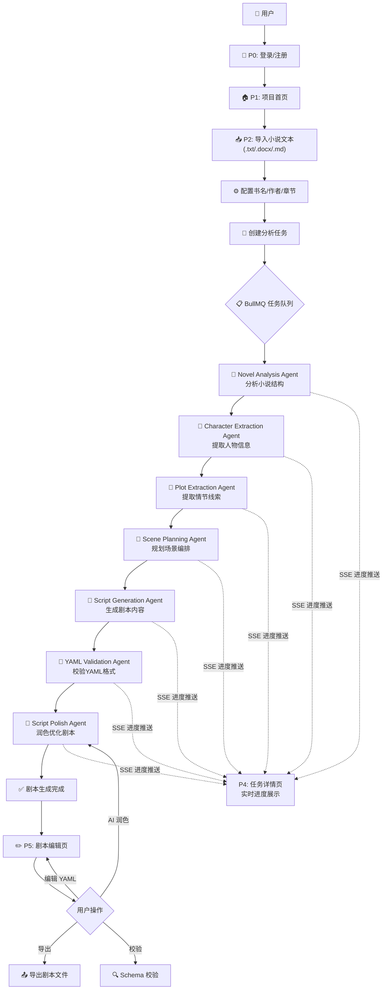
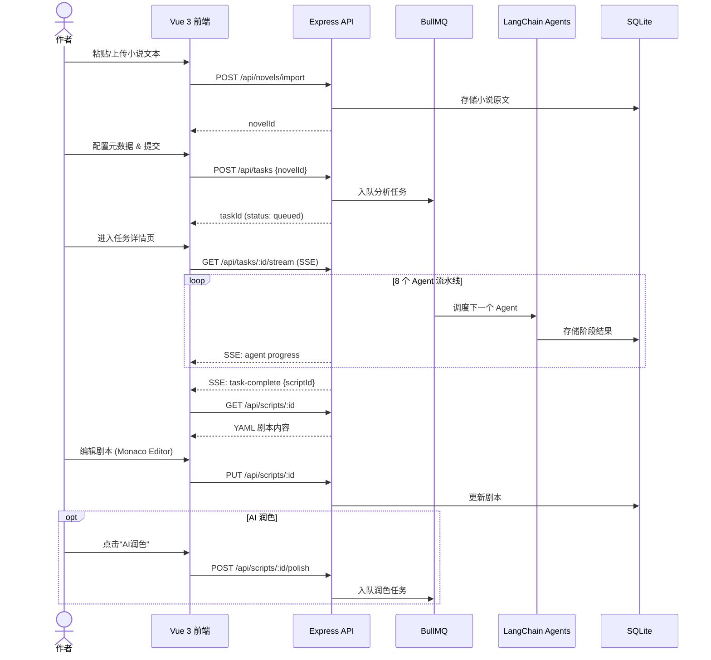

# PRD — AI小说转剧本工具

## 产品概述

一款 AI 辅助剧本创作工具，帮助小说作者将作品快速转换为结构化剧本（YAML 格式），降低改编门槛，提升效率。

## 目标用户

- 小说作者，希望将自己的作品改编为影视/舞台剧本
- 编剧，需要快速获取小说改编的剧本初稿

---

## 核心需求

| 编号 | 需求         | 描述                                   | 优先级 |
| ---- | ------------ | -------------------------------------- | ------ |
| R1   | 小说导入     | 支持导入 3 章以上 txt/docx/md 格式小说 | P0     |
| R2   | 长篇小说分析 | AI 自动分析小说结构、人物、情节        | P0     |
| R3   | 剧情拆解     | 将小说情节拆解为场景单元               | P0     |
| R4   | 场景规划     | 对拆解后的场景进行编排规划             | P1     |
| R5   | 剧本生成     | 输出结构化 YAML 格式剧本               | P0     |
| R6   | YAML Schema  | 定义并文档化剧本 YAML Schema           | P0     |
| R7   | 用户认证     | 注册/登录/密码重置                     | P0     |

## 非功能性需求

- 支持 3 章以上长文本处理
- 输出为可编辑、可进一步打磨的剧本初稿
- 前端需实时展示 AI 处理进度（SSE 流式输出）

## 约束条件

### 文件限制

| 参数           | 限制                     |
| -------------- | ------------------------ |
| 单文件上限     | 20 MB（txt / docx / md） |
| 章节范围       | 3 ~ 100 章               |
| 单项目字数上限 | 50 万字                  |
| 单用户存储上限 | 500 MB                   |

### 存储生命周期

| 文件类型            | 保留时长      |
| ------------------- | ------------- |
| 原始文件 + 中间文件 | 30 天自动清理 |
| 最终剧本            | 长期保存      |

### 并发限制

| 参数           | 限制 |
| -------------- | ---- |
| 最大运行任务数 | 1    |
| 最大排队任务数 | 3    |

### AI 处理分片

| 层级             | 策略                                         |
| ---------------- | -------------------------------------------- |
| 一级：章节分片   | 按章节边界切分                               |
| 二级：章节内切片 | 章节超 8000 字时按段落边界再切               |
| 三级：语义切片   | 保持语义完整性，单次 Agent 输入 5000~8000 字 |

### 技术约束

- 后端 LLM 对接 DeepSeek API
- 前端技术栈限定 Vue 3 + Element Plus
- 数据库使用 SQLite（轻量部署）

---

## Agent 职责定义

### Plot Extraction Agent（剧情拆解）

> 核心问题：**故事发生了什么？**

关注维度: 事件 → 冲突 → 转折 → 高潮 → 结局

### Scene Planning Agent（场景规划）

> 核心问题：**这些剧情应该如何拆成场景？**

关注维度: 时间 → 地点 → 参与者 → 场景目标

---

## 业务流程图

---

## 需求拆解: 页面 → 模块 → 功能 → 数据

---

### 页面: P0 登录注册页

> 路由: `/auth` | 优先级: P0

#### 模块: 登录表单

- 功能:
  - 账号 + 密码登录
  - 登录状态持久化（JWT Token）
- 数据字段:
  - 账号（必填）
  - 密码（必填）
  - Token

#### 模块: 注册表单

- 功能:
  - 注册新用户
  - 账号唯一性校验（实时/提交时）
- 数据字段:
  - 用户名（必填）
  - 账号（必填，不可重复）
  - 密码（必填）

#### 模块: 密码重置

- 功能:
  - 通过用户名验证身份
  - 重置密码
- 数据字段:
  - 用户名（必填）
  - 新密码（必填）

---

### 页面: P1 项目首页

> 路由: `/` | 优先级: P1

#### 模块: 导航栏

- 功能:
  - 展示全局导航菜单
  - 路由跳转（首页 / 导入 / 任务列表 / Schema文档）
  - 显示当前登录用户信息
  - 退出登录
- 数据字段:
  - 用户名
  - 登录状态

#### 模块: 项目概况

- 功能:
  - 展示项目简介与使用指引
  - 新手引导入口
- 数据字段:
  - —

#### 模块: 快速操作

- 功能:
  - 一键跳转导入小说
  - 一键跳转任务列表
- 数据字段:
  - —

#### 模块: 最近任务

- 功能:
  - 展示最近 N 条分析任务摘要
- 数据字段:
  - 任务 ID
  - 小说标题
  - 任务状态（排队中 / 进行中 / 已完成 / 失败）
  - 进度百分比
  - 更新时间

---

### 页面: P2 小说导入页

> 路由: `/import` | 优先级: P0

#### 模块: 文本输入区

- 功能:
  - 粘贴纯文本小说内容
  - 拖拽/点击上传小说文件
- 数据字段:
  - 小说原始文本
  - 文件名
  - 文件格式（.txt / .docx / .md）

#### 模块: 章节识别

- 功能:
  - **多级兜底策略**（按优先级依次尝试）:
    1. **一级 — 规则匹配**: 内置正则 + 自定义正则识别章节标题
    2. **二级 — 目录识别**: 若文本含目录页则优先使用目录结构
    3. **三级 — AI 辅助识别**: 规则匹配率 < 70% 时调用 AI 辅助
    4. **四级 — 按长度切片**: 以上均失败则按 5000~8000 字均匀切片
    5. **兜底 — 人工确认**: 展示识别结果让用户手动调整
  - 内置正则规则:
    - `^第[零一二三四五六七八九十百千万两\d]+章.*$`
    - `^第[零一二三四五六七八九十百千万两\d]+节.*$`
    - `^第[零一二三四五六七八九十百千万两\d]+回.*$`
    - `^第.*卷.*$`
    - `^Chapter\s+\d+.*$`
    - `^\d+$`（纯数字行）
  - 自定义正则：用户在章节识别设置中输入正则（如 `^\【.*\】$`），系统统计命中率，选择命中率最高的规则
- 数据字段:
  - 章节标题列表（含起始位置）
  - 章节数量
  - 识别策略（regex / toc / ai / slice / manual）
  - 命中率
  - 自定义正则列表

#### 模块: 元数据配置

- 功能:
  - 填写书名
  - 填写作者名
- 数据字段:
  - 书名（必填）
  - 作者（选填）
  - [待确认] 小说类型/标签
  - [待确认] 原文语言

#### 模块: 提交确认

- 功能:
  - 校验必填字段
  - 创建分析任务并跳转
- 数据字段:
  - novelId（创建后返回）
  - taskId（创建后返回）

---

### 页面: P3 分析任务页

> 路由: `/tasks` | 优先级: P0

#### 模块: 任务列表

- 功能:
  - 分页查看所有分析任务
  - 点击行跳转任务详情
- 数据字段:
  - 任务 ID
  - 小说标题
  - 任务状态
  - 进度百分比
  - 当前执行 Agent 名称
  - 创建时间
  - 更新时间

#### 模块: 状态筛选

- 功能:
  - 按状态过滤任务列表
- 数据字段:
  - 状态枚举值: `queued` | `processing` | `completed` | `failed`

#### 模块: 任务操作

- 功能:
  - 删除已完成/失败的任务
  - 重试失败任务（支持两种模式）:
    - 断点重试：从失败阶段恢复
    - 从头开始：清空结果重新执行
- 数据字段:
  - 任务 ID
  - 重试模式（resume / restart）

---

### 页面: P4 任务详情页

> 路由: `/tasks/:id` | 优先级: P0

#### 模块: 基本信息

- 功能:
  - 展示任务元数据摘要
- 数据字段:
  - 任务名称
  - 小说标题
  - 创建时间
  - 当前状态
  - 总耗时

#### 模块: Agent 流水线进度

- 功能:
  - SSE 实时展示 8 个 Agent 的执行进度
  - 已完成/进行中/等待中/失败 状态可视化
- 数据字段:
  - Agent 名称
  - Agent 状态（pending / running / done / failed）
  - 当前进度消息
  - [待确认] 每个 Agent 预估耗时

#### 模块: 中间结果展示

- 功能:
  - 展开查看每个已完成 Agent 的输出
  - 支持折叠/展开
- 数据字段:
  - [待确认] Novel Analysis 输出结构（章节划分/主题识别）
  - [待确认] Character Extraction 输出结构（人物列表/关系图）
  - [待确认] Plot Extraction 输出结构（情节线/冲突点）
  - [待确认] Scene Planning 输出结构（场景序列/转场）
  - [待确认] Script Generation 输出结构（剧本草稿）

#### 模块: 结果跳转

- 功能:
  - 任务完成后显示"进入剧本编辑"按钮
- 数据字段:
  - scriptId

---

### 页面: P5 剧本编辑页

> 路由: `/script/:id` | 优先级: P0

#### 模块: YAML 编辑器

- 功能:
  - Monaco Editor 编辑 YAML 剧本
  - 语法高亮
  - 自动补全（基于 Schema）
  - 格式化
- 数据字段:
  - 剧本 YAML 内容

#### 模块: Markdown 预览

- 功能:
  - 实时渲染 YAML 剧本为可读格式
  - 左右分屏或切换视图
- 数据字段:
  - 渲染后 HTML/Markdown

#### 模块: 工具栏

- 功能:
  - 保存剧本
  - 导出剧本文件（支持 yaml / json / md / pdf / txt）
  - 手动触发 Schema 校验
  - 请求 AI 润色（用户可选择润色风格方向）
- 数据字段:
  - 保存状态（已保存 / 未保存）
  - 校验结果（通过 / 错误列表）
  - 导出格式: `yaml` | `json` | `md` | `pdf` | `txt`
  - 润色风格: `原著还原` | `影视剧风格` | `短剧风格` | `动漫风格` | `电影风格` | `电视剧风格` | `舞台剧风格`

#### 模块: Schema 校验

- 功能:
  - 实时校验 YAML 是否符合 Schema 定义
  - 错误行高亮 & 消息提示
- 数据字段:
  - 校验错误列表（行号 + 错误描述）

#### 模块: 版本历史

- 功能:
  - 查看剧本的历史版本列表
  - 预览历史版本内容
  - 回滚到指定历史版本
- 数据字段:
  - 版本号
  - 保存时间
  - 版本备注（自动生成/手动填写）
  - 版本内容快照

#### 模块: 前端离线缓存

- 功能:
  - **一级缓存（必须）**: 草稿缓存 — 编辑中自动保存至 IndexedDB
  - **二级缓存（强烈推荐）**: YAML 编辑器自动保存（防丢失）
  - **三级缓存**: 任务状态恢复 — 刷新页面后恢复 SSE 进度
  - **四级缓存**: 生成结果缓存 — 已生成剧本本地缓存
- 数据字段:
  - `localStorage`: 用户配置、任务状态
  - `IndexedDB`: 小说原文、YAML 草稿、生成结果

---

### 页面: P6 YAML Schema 文档页

> 路由: `/schema` | 优先级: P1

#### 模块: Schema 结构展示

- 功能:
  - 可视化展示 YAML Schema 层级结构（树/图）
- 数据字段:
  - Schema 定义 JSON

#### 模块: 字段说明

- 功能:
  - 表格展示每个字段的详细说明
- 数据字段:
  - 字段名
  - 字段类型
  - 是否必填
  - 字段说明
  - 示例值

#### 模块: 设计原因

- 功能:
  - 阐述 Schema 设计理念与决策依据
  - **多版本共存**: Schema 支持版本号管理，旧版本剧本不受新 Schema 影响
  - **extensions 扩展区**: 在 Schema 中预留 `extensions` 字段，允许作者注入自定义属性
- 数据字段:
  - 设计文档 Markdown
  - Schema 版本号

#### 模块: 示例剧本

- 功能:
  - 展示一个完整的示例剧本
- 数据字段:
  - 示例 YAML 内容

---

## 系统交互流程

---

## 疑问列表

| #   | 疑问                                           | 涉及页面 | 状态                                                     |
| --- | ---------------------------------------------- | -------- | -------------------------------------------------------- |
| 1   | 小说导入支持哪些文件格式？                     | P2       | ✅ `.txt` `.docx` `.md`                                  |
| 2   | 章节自动识别失败时，用户如何手动标注章节边界？ | P2       | ✅ 五级兜底：规则→目录→AI→切片→人工                      |
| 3   | 单次最多支持多少字数/多少章节？分片策略？      | P2, 后端 | ✅ 3~100章, 单文件20MB, 三级分片, Agent输入5000~8000字   |
| 4   | 分析任务失败后重试策略？                       | P3, P4   | ✅ 断点重试或从头开始                                    |
| 5   | 并发上限？                                     | 后端     | ✅ 运行1 / 排队3                                         |
| 6   | 剧本编辑是否需要版本历史？                     | P5       | ✅ 需要版本历史+回滚                                     |
| 7   | Schema 多版本共存？自定义？                    | P6       | ✅ 多版本共存 + extensions 扩展区                        |
| 8   | 导出格式？                                     | P5       | ✅ yaml/json/md/pdf/txt                                  |
| 9   | 是否需要用户登录？                             | 全局     | ✅ 注册/登录/密码重置                                    |
| 10  | 剧情拆解 vs 场景规划边界？                     | AI流水线 | ✅ 拆解=事件/冲突/转折, 规划=时间/地点/参与者/目标       |
| 11  | AI 润色方向？                                  | P5, AI   | ✅ 7种风格：原著还原/影视剧/短剧/动漫/电影/电视剧/舞台剧 |
| 12  | 原文/中间文件存储策略？                        | P2, 后端 | ✅ 原文+中间30天, 最终剧本长期, 单用户500MB              |
| 13  | 章节识别规则？                                 | P2       | ✅ 内置6条正则 + 自定义正则（命中率择优）+ AI兜底        |
| 14  | 前端离线缓存？                                 | P5       | ✅ 四级缓存：localStorage + IndexedDB                    |
