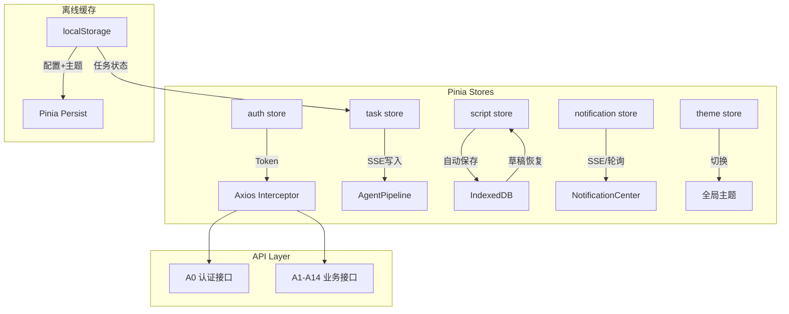

# 页面设计文档 — AI小说转剧本工具

> 基于 RequirementAnalyzer 输出自动生成
> 风格：**企业**（侧边导航 + 顶栏）
> 技术栈：Vue 3 + TypeScript + Element Plus

---

## 全局布局

> 风格：**企业**（侧边导航 + 顶栏），支持响应式适配 + 暗色模式切换

### 桌面端（≥768px）

```
+--------------------------------------------------+
| 顶栏: Logo | 首页 导入 任务 Schema | 🔔 🌙 用户▼    |
+-----+--------------------------------------------+
|     |                                             |
| 侧  |        主内容区 (router-view)                |
| 边  |                                             |
| 导  |                                             |
| 航  |                                             |
|     |                                             |
+-----+--------------------------------------------+
```

### 移动端（<768px）

```
+--------------------------------------------------+
| ☰ Logo                          🔔  🌙  👤       |
+--------------------------------------------------+
|                                                   |
|            主内容区 (router-view)                  |
|                                                   |
+--------------------------------------------------+
|   🏠首页  |  📥导入  |  📋任务  |  📐Schema     |
+--------------------------------------------------+
```

- 侧边导航 → 抽屉式菜单（左上角汉堡图标）
- 顶栏精简为图标
- 底部 Tab 导航（4 个主要入口）

### 全局组件

| 组件名             | 类型     | 功能                                             | 复用性 |
| ------------------ | -------- | ------------------------------------------------ | ------ |
| AppLayout          | 布局组件 | 侧边导航+顶栏+主内容区插槽，响应式切换           | 高     |
| AppLayoutMobile    | 布局组件 | 移动端布局：底部Tab+抽屉菜单                     | 高     |
| AuthGuard          | 路由守卫 | JWT 过期检测、未登录拦截跳转                     | 高     |
| SSEConnector       | 通用Hook | SSE 连接管理（自动重连、心跳）                   | 高     |
| NotificationCenter | 业务组件 | 全局消息通知（剧本生成完成/润色完成/任务失败等） | 高     |
| ThemeToggle        | 通用组件 | 暗色/亮色模式切换                                | 高     |

---

# 页面: P0 登录注册页

> 路由: `/auth` | 优先级: P0 | 风格: 简洁居中

## 功能说明

用户认证入口。支持账号密码登录、新用户注册（用户名+账号+密码，账号唯一性校验）、通过用户名重置密码。未登录用户访问任何页面均重定向至此。

## 页面布局

```
+--------------------------------------------------+
|                                                   |
|              🎬  NovelToScript                    |
|              AI 小说转剧本工具                     |
|                                                   |
|        +----------------------------+             |
|        | [ 登录 | 注册 | 重置密码 ] |             |
|        |                            |             |
|        |  账号  [_______________]   |             |
|        |  密码  [_______________]   |             |
|        |                            |             |
|        |     [     登  录     ]     |             |
|        |                            |             |
|        |     没有账号？立即注册 →    |             |
|        +----------------------------+             |
|                                                   |
+--------------------------------------------------+
```

## 布局说明

- 居中卡片式布局，登录/注册/重置密码通过顶部 Tab 切换
- 注册表单额外显示"用户名"字段，提交时校验账号唯一性
- 重置密码流程分两步：先验证用户名，再设新密码
- Tab 切换和表单校验不重新加载页面

## 建议组件

| 组件名       | 类型     | 功能                                     | 复用性 |
| ------------ | -------- | ---------------------------------------- | ------ |
| LoginForm    | 业务组件 | 账号+密码登录表单，记住密码              | 低     |
| RegisterForm | 业务组件 | 用户名+账号+密码注册，实时校验账号唯一性 | 低     |
| ResetPwdForm | 业务组件 | 用户名验证 → 新密码设置                  | 低     |
| AuthTabs     | 通用组件 | 登录/注册/重置密码 Tab 切换              | 中     |

## 数据来源

| 模块     | 数据字段           | 来源接口                   | 请求方式 |
| -------- | ------------------ | -------------------------- | -------- |
| 登录     | 账号、密码、Token  | `/api/auth/login`          | POST     |
| 注册     | 用户名、账号、密码 | `/api/auth/register`       | POST     |
| 重置密码 | 用户名、新密码     | `/api/auth/reset-password` | POST     |

## 交互说明

### 登录

- 触发方式：点击"登录"按钮 / 回车
- 校验：账号必填、密码必填（≥6位）
- 行为：成功后存储 JWT → 跳转首页 `/`
- 异常：401 提示"账号或密码错误"，网络异常提示"请检查网络"

### 注册

- 触发方式：Tab 切换到"注册"
- 校验：用户名必填(2-20字)、账号必填(仅字母数字下划线)、密码必填(≥6位)
- 账号唯一性：失焦时调用后端校验，已存在则红色提示"账号已存在"
- 成功后：自动跳转登录Tab并提示"注册成功，请登录"

### 密码重置

- 触发方式：Tab 切换到"重置密码" / 登录表单"忘记密码"链接
- 流程：输入用户名 → 后端验证存在 → 输入新密码 → 提交
- 异常：用户名不存在提示"该用户名未注册"

## 目录建议

```
src/views/Auth/
├── AuthPage.vue              # 页面容器
├── components/
│   ├── LoginForm.vue         # 登录表单
│   ├── RegisterForm.vue      # 注册表单
│   └── ResetPwdForm.vue      # 密码重置表单
└── hooks/
    └── useAuth.js            # 登录/注册/登出逻辑 + Token管理
```

---

# 页面: P1 项目首页

> 路由: `/` | 优先级: P1 | 风格: 企业

## 功能说明

登录后的默认首页。展示项目简介与快速入口，以及用户最近的AI分析任务摘要，方便快速继续工作。

## 页面布局

```
+--------------------------------------------------+
|  📊 项目概览                                      |
|  NovelToScript — AI辅助剧本创作                    |
+--------------------------------------------------+
|  🚀 快速操作                                       |
|  [ 📥 导入小说 ]  [ 📋 查看任务 ]                  |
+--------------------------------------------------+
|  📌 最近任务                                       |
|--------------------------------------------------|
| 任务名       | 状态   | 进度  | 时间    | 操作    |
|--------------|--------|-------|---------|---------|
| 斗破苍穹分析 | ✅完成 | 100%  | 10:30   | 查看 →  |
| 凡人修仙分析 | 🔄进行 |  45%  | 11:15   | 查看 →  |
| 诡秘之主分析 | ❌失败 |  32%  | 09:00   | 查看 →  |
+--------------------------------------------------+
|  📭 暂无任务，[ 去导入小说 → ]      ← 空状态占位   |
+--------------------------------------------------+
|              共 5 条，查看全部 →                    |
+--------------------------------------------------+
```

## 布局说明

- 页面自上而下：项目概览卡片 → 快速操作按钮 → 最近任务表格
- 表格显示最近 5 条，空状态显示 `📭 暂无任务，[去导入小说 →]`
- 点击行或"查看"链接跳转 P4 任务详情页
- 快速操作按钮跳转 P2 导入页 / P3 任务列表

## 建议组件

| 组件名         | 类型     | 功能                   | 复用性 |
| -------------- | -------- | ---------------------- | ------ |
| ProjectIntro   | 业务组件 | 项目简介卡片，静态展示 | 低     |
| QuickActions   | 业务组件 | 快速操作按钮组         | 低     |
| RecentTaskList | 业务组件 | 最近 N 条任务摘要列表  | 中     |
| TaskStatusTag  | 通用组件 | 任务状态彩色标签       | 高     |

## 数据来源

| 模块     | 数据字段                               | 来源接口                | 请求方式 |
| -------- | -------------------------------------- | ----------------------- | -------- |
| 最近任务 | 任务ID、小说标题、状态、进度、更新时间 | `/api/tasks?pageSize=5` | GET      |

## 交互说明

### 最近任务

- 加载策略：进入页面时请求最近 5 条
- 空状态：无任务时展示"还没有任务，去导入小说吧 →"
- 点击行：跳转 `P4 任务详情页 /tasks/:id`
- "查看全部"按钮：跳转 `P3 分析任务页 /tasks`

### 快速操作

- "导入小说"：跳转 `P2 /import`
- "查看任务"：跳转 `P3 /tasks`

## 目录建议

```
src/views/Home/
├── HomePage.vue              # 页面容器
├── components/
│   ├── ProjectIntro.vue      # 项目简介卡片
│   ├── QuickActions.vue      # 快速操作按钮组
│   └── RecentTaskList.vue    # 最近任务列表
└── hooks/
    └── useHome.js            # 首页数据加载
```

---

# 页面: P2 小说导入页

> 路由: `/import` | 优先级: P0 | 风格: 企业

## 功能说明

核心导入流程：上传/粘贴小说文本（.txt/.docx/.md，≤20MB）→ 五级兜底章节识别 → 填写元数据 → 确认提交创建分析任务。支持自定义正则规则提高章节识别准确率。

## 页面布局

```
+--------------------------------------------------+
| Step ①上传 → ②章节识别 → ③元数据 → ④确认         |
+--------------------------------------------------+
| Step 1: 上传文件                                  |
| +----------------------------------------------+ |
| |    📁  拖拽文件到此处或点击上传               | |
| |   支持 .txt .docx .md  单文件 ≤ 20MB         | |
| +----------------------------------------------+ |
| 或粘贴文本: [______________________________]     |
+--------------------------------------------------+
| Step 2: 章节识别            策略: 规则✓  命中 92%  |
| +----------------------------------------------+ |
| | 识别到 24 章  [ 展开内置规则 ▲ ]              | |
| | 自定义正则: [ ^\【.*\】$ ]  [ + 添加 ]       | |
| | [ 📋 章节预览 ]  可手动拆分/合并/调整         | |
| +----------------------------------------------+ |
+--------------------------------------------------+
| Step 3: 元数据                                    |
| 书名* [______________________________]           |
| 作者  [______________________________]           |
+--------------------------------------------------+
| [  创建分析任务  ]           总字数: 12.5 万字      |
+--------------------------------------------------+
```

## 建议组件

| 组件名          | 类型     | 功能                                          | 复用性 |
| --------------- | -------- | --------------------------------------------- | ------ |
| FileDropZone    | 通用组件 | 拖拽/点击上传区域，格式校验，大小校验         | 中     |
| TextPasteArea   | 通用组件 | 大文本粘贴输入框，字数统计                    | 中     |
| ChapterDetector | 业务组件 | 章节识别引擎，展示识别结果+命中率，多策略切换 | 低     |
| RegexRuleEditor | 业务组件 | 自定义正则规则增删，实时预览命中行数          | 低     |
| ChapterPreview  | 业务组件 | 章节列表预览，支持拖拽排序、合并、拆分        | 低     |
| NovelMetaForm   | 业务组件 | 书名/作者表单                                 | 中     |
| ImportStepper   | 通用组件 | 步骤条（上传→识别→元数据→确认）               | 高     |

## 数据来源

| 模块       | 数据字段              | 来源接口                  | 请求方式 |
| ---------- | --------------------- | ------------------------- | -------- |
| 上传小说   | 文件/文本、书名、作者 | `/api/novels/import`      | POST     |
| 创建任务   | novelId               | `/api/tasks`              | POST     |
| AI辅助识别 | 文本片段              | `/api/ai/detect-chapters` | POST     |

## 交互说明

### 上传

- 拖拽上传/点击选择本地文件
- 前端校验：格式白名单(.txt/.docx/.md)、大小 ≤20MB
- 粘贴模式：切换至文本框，粘贴后统计字数
- 异常：格式不支持 → 红色提示"仅支持 .txt .docx .md"；超出20MB → "文件过大，最大20MB"

### 章节识别

- 上传完成后自动触发规则匹配
- 策略优先级显示（当前使用策略高亮）
- 命中率 < 70% 时弹出"是否使用AI辅助识别？"
- 自定义正则：输入正则后实时高亮匹配行，显示命中数
- 章节预览弹窗中可：合并相邻章节、拆分章节、调整章节标题
- 最终结果需用户确认才能进入下一步

### 元数据

- 书名必填，作者选填
- 点击"创建分析任务"：
  - 先 POST `/api/novels/import` → 得 novelId
  - 再 POST `/api/tasks` {novelId} → 得 taskId
  - Loading 遮罩
  - 成功后跳转 `P4 任务详情页 /tasks/:taskId`

## 目录建议

```
src/views/Import/
├── ImportPage.vue            # 页面容器 + 步骤条
├── components/
│   ├── FileDropZone.vue      # 文件拖拽上传
│   ├── TextPasteArea.vue     # 文本粘贴区
│   ├── ChapterDetector.vue   # 章节识别面板
│   ├── RegexRuleEditor.vue   # 自定义正则编辑器
│   ├── ChapterPreview.vue    # 章节预览+手动调整弹窗
│   └── NovelMetaForm.vue     # 元数据表单
├── hooks/
│   ├── useFileImport.js      # 文件上传+粘贴逻辑
│   ├── useChapterDetect.js   # 章节识别引擎（5级策略）
│   └── useImportFlow.js      # 导入流程状态机（步骤切换）
└── utils/
    └── chapterRegex.js       # 内置正则常量 + 自定义规则统计
```

---

# 页面: P3 分析任务页

> 路由: `/tasks` | 优先级: P0 | 风格: 企业

## 功能说明

管理所有AI分析任务。分页列表展示、按状态筛选、删除任务、重试失败任务（断点重试/从头开始）。队列状态指示（运行1/排队3）。

## 页面布局

```
+--------------------------------------------------+
|  📋 分析任务             队列: 1/3  [ + 新建任务 ]  |
+--------------------------------------------------+
| 筛选: [ 全部 ] [ 排队中 ] [ 进行中 ] [ 已完成 ]    |
|       [ 失败 ]                                    |
+--------------------------------------------------+
| 任务名     | 状态   | 进度  | 创建时间 | 操作     |
|------------|--------|-------|----------|----------|
| 斗破苍穹   | ✅完成 | 100%  | 10:30    | 查看 删除|
| 凡人修仙传 | 🔄进行 |  45%  | 11:15    | 查看     |
| 诡秘之主   | ❌失败 |  32%  | 09:00    | 重试 删除|
| 遮天       | ⏳排队 |  ---  | 11:20    | 取消     |
+--------------------------------------------------+
|  📭 暂无任务，[ 创建第一个 → ]      ← 空状态占位   |
+--------------------------------------------------+
|             < 1  2  3 >   共 12 条                 |
+--------------------------------------------------+
```

## 布局说明

- 右上角 `[ + 新建任务 ]` 跳转 P2 导入页，排队满时置灰
- 顶部筛选栏支持多选，点击切换状态高亮
- 表格按创建时间倒序，每页 20 条
- 空状态显示 `📭 暂无任务，[创建第一个 →]`
- "重试"按钮仅 failed 状态行显示，点击弹出 RetryDialog（弹窗不占布局空间）
- "删除"仅 completed/failed 状态可操作，点击弹出确认框

## 建议组件

| 组件名           | 类型     | 功能                               | 复用性 |
| ---------------- | -------- | ---------------------------------- | ------ |
| TaskTable        | 业务组件 | 任务列表表格（含排序）             | 低     |
| TaskStatusFilter | 通用组件 | 状态多选/单选筛选条                | 中     |
| TaskRowActions   | 业务组件 | 行操作按钮组（查看/重试/删除）     | 低     |
| RetryDialog      | 业务组件 | 重试确认弹窗（选择resume/restart） | 低     |
| QueueIndicator   | 通用组件 | 队列状态指示（运行数/排队数/上限） | 中     |

## 数据来源

| 模块     | 数据字段                                          | 来源接口               | 请求方式 |
| -------- | ------------------------------------------------- | ---------------------- | -------- |
| 任务列表 | 任务ID、小说标题、状态、进度、Agent名称、创建时间 | `/api/tasks`           | GET      |
| 筛选     | 状态枚举                                          | `/api/tasks?status=`   | GET      |
| 重试     | 任务ID、重试模式                                  | `/api/tasks/:id/retry` | POST     |
| 删除     | 任务ID                                            | `/api/tasks/:id`       | DELETE   |

## 交互说明

### 列表

- 分页加载，默认每页 20 条，按创建时间倒序
- 状态列用彩色标签展示（El-Tag）
- 进度列：queued 显示"--"，processing 显示进度条，completed 显示"✅"，failed 显示"❌"
- 点击行跳转 P4 任务详情 `/tasks/:id`

### 筛选

- 支持点击切换单个状态（高亮），再次点击取消
- 可多选同时查看多个状态
- 筛选变化时重新请求第 1 页

### 重试

- 仅 failed 状态行显示"重试"按钮
- 点击弹出 RetryDialog：两个选项
  - "断点重试"（推荐）：从失败阶段继续，保留已完成结果
  - "从头开始"：清空所有结果重新执行
- 确认后 POST → 刷新列表

### 删除

- 仅 completed / failed 状态可删除
- 点击弹出确认框："确定删除该任务？"
- 确认后 DELETE → 刷新列表 → Message 提示

### 队列指示

- 顶部显示当前队列状态 "运行: 1 / 1, 排队: 2 / 3"
- 排队满 3 时，"创建任务"按钮置灰并提示"排队已满，请稍后再试"

## 目录建议

```
src/views/Tasks/
├── TaskListPage.vue          # 页面容器
├── components/
│   ├── TaskTable.vue         # 任务列表表格
│   ├── TaskStatusFilter.vue  # 状态筛选条
│   ├── TaskRowActions.vue    # 行操作按钮组
│   ├── RetryDialog.vue       # 重试确认弹窗
│   └── QueueIndicator.vue    # 队列状态指示
└── hooks/
    └── useTaskList.js        # 列表加载/筛选/分页/操作逻辑
```

---

# 页面: P4 任务详情页

> 路由: `/tasks/:id` | 优先级: P0 | 风格: 企业

## 功能说明

实时追踪单个AI分析任务的执行进度。SSE 推送 7 个 Agent 的流水线状态，每阶段完成后可展开查看中间结果。任务完成后一键跳转剧本编辑。

## 页面布局

```
+--------------------------------------------------+
| ← 返回任务列表       📊 斗破苍穹分析                |
| 状态: 🔄 进行中              耗时: 3分24秒          |
+--------------------------------------------------+
|  Agent 流水线                                      |
|--------------------------------------------------|
| Novel Analysis      ✅ 已完成          2.1s       |
| Character Extract   ✅ 已完成         15.8s       |
| Plot Extraction     ✅ 已完成         42.3s       |
| Scene Planning      🔄 进行中  ████░░ 67%         |
| Script Generation   ⏳ 等待中           --        |
| YAML Validation     ⏳ 等待中           --        |
| Script Polish       ⏳ 等待中           --        |
+--------------------------------------------------+
|  中间结果（点击展开）                              |
|  ▶ Novel Analysis: 24章，都市玄幻题材              |
|  ▶ Character Extract: 主角+配角 18人               |
|  ▶ Plot Extraction: 3条主线+7个冲突点              |
+--------------------------------------------------+
|          [ 进入剧本编辑 ]  ← 完成后激活             |
+--------------------------------------------------+
```

## 布局说明

- 左上角 `← 返回任务列表` 面包屑导航，点击返回 P3
- SSE 实时推送更新流水线状态，每阶段完成后自动更新
- running 阶段显示进度条 `████░░ 67%`
- 已完成阶段可展开查看中间结果（折叠面板，不占布局空间）
- 任务失败时对应 Agent 显示 ❌ + 错误信息
- "进入剧本编辑"按钮仅在全部7个Agent完成后激活

## 建议组件

| 组件名             | 类型     | 功能                               | 复用性 |
| ------------------ | -------- | ---------------------------------- | ------ |
| TaskInfoHeader     | 业务组件 | 任务基本信息摘要（标题/状态/耗时） | 低     |
| AgentPipeline      | 业务组件 | 7 阶段流水线可视化进度（SSE驱动）  | 中     |
| AgentResultPanel   | 业务组件 | 单个 Agent 结果折叠面板            | 高     |
| TaskCompleteAction | 业务组件 | 完成后的操作按钮组                 | 低     |

## 数据来源

| 模块       | 数据字段                               | 来源接口                          | 请求方式 |
| ---------- | -------------------------------------- | --------------------------------- | -------- |
| 基本信息   | 任务ID、小说标题、状态、创建时间、耗时 | `/api/tasks/:id`                  | GET      |
| 流水线进度 | Agent名称、状态、消息、当前进度        | `/api/tasks/:id/stream`           | SSE      |
| 中间结果   | 每阶段 output                          | `/api/tasks/:id` (含agentResults) | GET      |

## 交互说明

### SSE 连接

- 页面挂载时建立 SSE 连接
- 断线自动重连（3次，间隔 2s/4s/8s）
- 心跳检测：30s 无消息视为断线
- 页面卸载时关闭连接

### 流水线展示

- 7 个阶段纵向排列，每行显示：Agent名称 | 状态图标 | 耗时
- 状态图标映射：✅ done / 🔄 running / ⏳ pending / ❌ failed
- running 状态时进度条动画
- 当前阶段完成后，下一阶段自动更新

### 中间结果

- 每个已完成的 Agent 可展开查看输出摘要
- 默认折叠所有，用户按需展开
- 输出为结构化 JSON，格式化展示
- 当前运行 Agent 显示实时日志流

### 完成后

- 全部 7 个 Agent 完成 → SSE 推送 `task-complete` 事件
- 流水线显示全部 ✅，"进入剧本编辑"按钮激活
- 点击跳转 `P5 /script/:scriptId`
- 若任务失败：failed Agent 显示 ❌ + 错误信息，底部显示"断点重试"/"从头重试"

## 目录建议

```
src/views/TaskDetail/
├── TaskDetailPage.vue        # 页面容器
├── components/
│   ├── TaskInfoHeader.vue    # 基本信息摘要
│   ├── AgentPipeline.vue     # 流水线进度条（SSE驱动）
│   ├── AgentResultPanel.vue  # Agent结果折叠面板
│   └── TaskCompleteAction.vue # 完成后操作按钮
└── hooks/
    ├── useSSE.js             # SSE连接+重连+心跳
    └── useTaskDetail.js      # 任务详情加载+流水线状态更新
```

---

# 页面: P5 剧本编辑页

> 路由: `/script/:id` | 优先级: P0 | 风格: 企业

## 功能说明

核心编辑页。左侧 Monaco Editor 编辑 YAML 剧本（语法高亮+Schema自动补全），右侧 Markdown 实时预览。支持保存、导出（yaml/json/md/pdf/txt）、Schema校验、AI润色（7种风格）、版本历史回滚、离线缓存自动保存。

## 页面布局

```
+--------------------------------------------------+
| ✏️ 剧本编辑: 斗破苍穹           💾已保存 | v3      |
| [ ◐分屏 | 📝仅编辑 | 📖仅预览 ]                    |
| [ 💾保存 ] [ 📤导出▼ ] [ ✨润色▼ ] [ ··· 更多 ▼ ]  |
+----------------------+---------------------------+
|    Monaco Editor     |     📖 Markdown 预览       |
|                      |                           |
| title: 斗破苍穹      |   # 斗破苍穹               |
| scenes:              |                           |
|   - scene: 1         |   ## 第一场                |
|     location: 练武场 |   地点: 萧家练武场         |
|     characters:      |   人物: 萧炎               |
|       - 萧炎         |   ...                      |
|     dialogues:       |                           |
|       - speaker: 萧炎|                           |
|         text: ...    |                           |
+----------------------+---------------------------+
| ⚠ Schema校验: 3个错误 | 缓存: 🔒 已开启           |
+--------------------------------------------------+
```

## 布局说明

- 视图切换栏：`[◐分屏 | 📝仅编辑 | 📖仅预览]` 三种模式
- 工具栏主次分离：`保存` 主按钮突出，`导出▼` `润色▼` 常用下拉，`校验` `历史` 收入 `··· 更多▼`
- 左右分屏：左Monaco Editor (YAML) / 右Markdown预览
- 工具栏按钮触发的弹窗均不占布局空间：
  - ExportMenu → 导出格式下拉菜单
  - PolishDialog → 润色风格+范围选择弹窗
  - VersionHistory → 版本历史右侧抽屉
- 底部校验面板点击错误行可跳转到编辑器对应位置
- 离线缓存状态实时显示：🔒已开启 / 🔓未开启

## 建议组件

| 组件名           | 类型     | 功能                                      | 复用性 |
| ---------------- | -------- | ----------------------------------------- | ------ |
| ScriptToolbar    | 业务组件 | 工具栏：保存/导出/校验/润色/历史按钮      | 低     |
| YamlEditor       | 通用组件 | Monaco Editor 封装（YAML模式+Schema补全） | 高     |
| MarkdownPreview  | 通用组件 | YAML→Markdown 实时渲染预览                | 中     |
| ExportMenu       | 业务组件 | 导出格式下拉菜单（yaml/json/md/pdf/txt）  | 低     |
| PolishDialog     | 业务组件 | 润色确认弹窗（风格选择+范围选择）         | 低     |
| SchemaValidation | 业务组件 | 实时校验结果面板（错误列表+行号跳转）     | 中     |
| VersionHistory   | 业务组件 | 版本列表侧边抽屉（预览+回滚）             | 低     |
| CacheIndicator   | 通用组件 | 离线缓存状态图标+提示                     | 中     |

## 数据来源

| 模块     | 数据字段           | 来源接口                          | 请求方式 |
| -------- | ------------------ | --------------------------------- | -------- |
| 加载剧本 | 剧本内容、版本号   | `/api/scripts/:id`                | GET      |
| 保存     | 更新后YAML内容     | `/api/scripts/:id`                | PUT      |
| 导出     | 格式参数           | `/api/scripts/:id/export?format=` | GET      |
| 校验     | Schema定义         | `/api/schema`                     | GET      |
| 润色     | 风格、目标范围     | `/api/scripts/:id/polish`         | POST     |
| 版本列表 | 版本号、时间、备注 | `/api/scripts/:id/versions`       | GET      |
| 版本内容 | 指定版本YAML       | `/api/scripts/:id/versions/:v`    | GET      |
| 回滚     | 目标版本号         | `/api/scripts/:id/rollback`       | POST     |

## 交互说明

### 编辑器

- Monaco Editor 配置：YAML 语言模式、基于 Schema 的自动补全
- 监听内容变更，3 秒防抖自动保存至 IndexedDB（一级缓存）
- 30 秒防抖自动保存至后端（二级缓存）
- 未保存提示：顶部显示"💾 已保存" / "🟡 未保存"

### 预览

- 左侧编辑实时触发右侧 Markdown 渲染
- 支持左右分屏 / 仅编辑 / 仅预览三种视图切换
- 预览中场景标题可折叠

### 导出

- 点击"导出"下拉选择格式：yaml / json / md / pdf / txt
- yaml / json / md / txt：前端直接下载
- **PDF 双方案**:
  - **正式导出** → 后端 Puppeteer：点击"导出 PDF"→ 后端渲染精美排版（封面+目录+正文）→ 下载
  - **快速预览** → 前端 jsPDF：点击"快速下载 PDF"→ 前端直接生成简易版 PDF → 即时下载
- 下载文件名：`{书名}_剧本_v{版本号}.{扩展名}`

### Schema 校验

- 手动触发"校验"按钮 或 保存时自动校验
- 底部显示校验结果面板：通过 ✅ / 错误数 + 错误列表
- 点击错误行可跳转到 Monaco Editor 对应位置
- 错误列表含：行号 + 字段路径 + 错误描述

### AI 润色

- 点击"润色"弹出 PolishDialog
- 选择润色风格（单选）：原著还原 / 影视剧 / 短剧 / 动漫 / 电影 / 电视剧 / 舞台剧
- 选择范围：全部 / 指定场景（输入场景编号）
- 确认后 POST 创建润色任务 → SSE 跟踪 → 完成后自动替换编辑器内容

### 版本历史

- 点击"历史"按钮打开右侧抽屉
- 版本列表：版本号 | 时间 | 备注 | [预览] [回滚]
- 点击"预览"：只读展示该版本内容
- 点击"回滚"：确认弹窗 → POST → 刷新编辑器内容 → 版本号自增

### 离线缓存

- 编辑器内容实时写入 IndexedDB
- 断网时顶部显示黄色提示条"当前离线，内容已缓存至本地"
- 恢复网络后自动同步，提示"内容已同步至云端"

## 目录建议

```
src/views/ScriptEditor/
├── ScriptEditorPage.vue       # 页面容器（分屏布局）
├── components/
│   ├── ScriptToolbar.vue      # 工具栏
│   ├── YamlEditor.vue         # Monaco Editor封装
│   ├── MarkdownPreview.vue    # 剧本预览渲染
│   ├── ExportMenu.vue         # 导出格式下拉菜单
│   ├── PolishDialog.vue       # 润色风格选择弹窗
│   ├── SchemaValidation.vue   # 校验结果面板
│   ├── VersionHistory.vue     # 版本历史抽屉
│   └── CacheIndicator.vue     # 缓存状态指示
├── hooks/
│   ├── useScriptEditor.js     # 编辑器核心逻辑（保存/加载/自动保存）
│   ├── useScriptPreview.js    # YAML→Markdown 转换
│   ├── useSchemaValidate.js   # Schema 校验
│   ├── useVersionHistory.js   # 版本管理
│   ├── usePolish.js           # AI 润色逻辑
│   └── useCache.js            # IndexedDB 读写封装
└── utils/
    └── yamlToMarkdown.js      # YAML → Markdown 渲染器
```

---

# 页面: P6 YAML Schema 文档页

> 路由: `/schema` | 优先级: P1 | 风格: 企业

## 功能说明

展示剧本 YAML Schema 的完整定义文档。包含Schema结构可视化（树形图）、字段说明表格、设计原因阐述（多版本共存+extensions扩展区）、示例剧本。

## 页面布局

```
+--------------------------------------------------+
|  📐 YAML Schema v1.0.0                             |
+--------------------------------------------------+
| Schema 结构                                        |
|--------------------------------------------------|
| script                                            |
|  ├─ meta               (元数据)                   |
|  │   ├─ title            string                   |
|  │   ├─ author           string                   |
|  │   └─ source           string                   |
|  ├─ characters         (人物列表)                 |
|  │   └─ [*]                                       |
|  │       ├─ name          string                  |
|  │       ├─ role          enum                    |
|  │       └─ desc          string                  |
|  ├─ scenes             (场景列表)                 |
|  │   └─ [*]                                       |
|  │       ├─ id            int                     |
|  │       ├─ location      string                  |
|  │       ├─ time          string                  |
|  │       ├─ characters    []                      |
|  │       └─ dialogues     []                      |
|  ├─ extensions         (扩展区, 作者自定义)        |
|  └─ version              string                   |
+--------------------------------------------------+
|  📋 字段说明                                       |
|--------------------------------------------------|
| 字段           | 类型   | 必填 | 说明             |
|----------------|--------|------|-----------------|
| meta.title     | string |  ✅  | 剧本标题         |
| meta.author    | string |      | 原作者           |
| scenes[].loc   | string |  ✅  | 场景地点         |
| ...                                              |
+--------------------------------------------------+
|  💡 设计原因: 多版本共存 + extensions 扩展区       |
|  📄 示例剧本 [ 展开 / 收起 ]                       |
+--------------------------------------------------+
```

## 布局说明

- 树形结构展示 Schema 层级，点击节点联动高亮字段说明表格
- 字段说明表格支持按字段名搜索、按必填/可选筛选
- 设计原因和示例剧本为可折叠区域
- Schema 版本号通过 VersionBadge 组件展示

## 建议组件

| 组件名           | 类型     | 功能                                       | 复用性 |
| ---------------- | -------- | ------------------------------------------ | ------ |
| SchemaTree       | 通用组件 | Schema 树形结构可视化                      | 中     |
| SchemaFieldTable | 通用组件 | 字段说明表格（字段名/类型/必填/说明/示例） | 中     |
| SchemaRationale  | 业务组件 | 设计原因展示（Markdown渲染）               | 低     |
| ScriptExample    | 业务组件 | 示例剧本折叠展示                           | 低     |
| VersionBadge     | 通用组件 | Schema版本号标识                           | 中     |

## 数据来源

| 模块       | 数据字段                      | 来源接口      | 请求方式 |
| ---------- | ----------------------------- | ------------- | -------- |
| Schema定义 | schema JSON、版本号、设计文档 | `/api/schema` | GET      |

## 交互说明

### Schema 树

- 树形展示 Schema 层级结构
- 支持全部展开/全部折叠
- 点击节点高亮对应字段说明表格中的行

### 字段说明

- 表格列：字段路径 | 类型 | 必填 | 说明 | 示例
- 支持搜索过滤字段名
- 支持按必填/可选筛选

### 设计原因

- Markdown 渲染展示
- 多版本共存说明
- extensions 扩展区用法示例

### 示例剧本

- 默认折叠，点击展开
- 展示完整 YAML 示例
- 可复制

## 目录建议

```
src/views/Schema/
├── SchemaPage.vue            # 页面容器
├── components/
│   ├── SchemaTree.vue        # Schema结构树形图
│   ├── SchemaFieldTable.vue  # 字段说明表格
│   ├── SchemaRationale.vue   # 设计原因
│   └── ScriptExample.vue     # 示例剧本
└── hooks/
    └── useSchema.js          # Schema数据加载
```

---

## 全局目录总览

```
src/
├── App.vue
├── main.ts
├── router/
│   └── index.ts              # 路由配置 + AuthGuard
├── api/
│   ├── request.ts            # Axios 实例 + 拦截器（JWT注入/401处理）
│   ├── auth.ts               # A0a/A0b/A0c
│   ├── novels.ts             # A1
│   ├── tasks.ts              # A2/A3/A4/A10
│   ├── tasksSSE.ts           # A5 (SSE封装)
│   ├── scripts.ts            # A6/A7/A8/A11/A12/A13/A14
│   └── schema.ts             # A9
├── stores/
│   ├── auth.ts               # Pinia: 用户信息+Token
│   ├── task.ts               # Pinia: 当前任务状态（SSE写入）
│   ├── script.ts             # Pinia: 当前剧本编辑状态
│   ├── notification.ts       # Pinia: 全局通知队列
│   └── theme.ts              # Pinia: 暗色/亮色主题状态
├── components/
│   ├── AppLayout.vue         # 全局布局（桌面端：侧边导航+顶栏）
│   ├── AppLayoutMobile.vue   # 全局布局（移动端：底部Tab+抽屉菜单）
│   ├── AuthGuard.vue         # 路由鉴权守卫
│   ├── NotificationCenter.vue # 全局消息通知中心
│   ├── ThemeToggle.vue       # 暗色/亮色模式切换
│   ├── TaskStatusTag.vue     # 任务状态彩色标签
│   ├── QueueIndicator.vue    # 队列状态指示
│   └── CacheIndicator.vue    # 缓存状态指示
├── hooks/
│   ├── useSSE.js             # SSE 通用Hook（重连+心跳）
│   └── useCache.js           # IndexedDB 通用封装
├── views/
│   ├── Auth/
│   │   ├── AuthPage.vue
│   │   ├── components/
│   │   │   ├── LoginForm.vue
│   │   │   ├── RegisterForm.vue
│   │   │   └── ResetPwdForm.vue
│   │   └── hooks/
│   │       └── useAuth.js
│   ├── Home/
│   │   ├── HomePage.vue
│   │   └── components/
│   │       ├── ProjectIntro.vue
│   │       ├── QuickActions.vue
│   │       └── RecentTaskList.vue
│   ├── Import/
│   │   ├── ImportPage.vue
│   │   ├── components/
│   │   │   ├── FileDropZone.vue
│   │   │   ├── TextPasteArea.vue
│   │   │   ├── ChapterDetector.vue
│   │   │   ├── RegexRuleEditor.vue
│   │   │   ├── ChapterPreview.vue
│   │   │   └── NovelMetaForm.vue
│   │   ├── hooks/
│   │   │   ├── useFileImport.js
│   │   │   ├── useChapterDetect.js
│   │   │   └── useImportFlow.js
│   │   └── utils/
│   │       └── chapterRegex.js
│   ├── Tasks/
│   │   ├── TaskListPage.vue
│   │   ├── components/
│   │   │   ├── TaskTable.vue
│   │   │   ├── TaskStatusFilter.vue
│   │   │   ├── TaskRowActions.vue
│   │   │   └── RetryDialog.vue
│   │   └── hooks/
│   │       └── useTaskList.js
│   ├── TaskDetail/
│   │   ├── TaskDetailPage.vue
│   │   ├── components/
│   │   │   ├── TaskInfoHeader.vue
│   │   │   ├── AgentPipeline.vue
│   │   │   ├── AgentResultPanel.vue
│   │   │   └── TaskCompleteAction.vue
│   │   └── hooks/
│   │       ├── useSSE.js
│   │       └── useTaskDetail.js
│   ├── ScriptEditor/
│   │   ├── ScriptEditorPage.vue
│   │   ├── components/
│   │   │   ├── ScriptToolbar.vue
│   │   │   ├── YamlEditor.vue
│   │   │   ├── MarkdownPreview.vue
│   │   │   ├── ExportMenu.vue
│   │   │   ├── PolishDialog.vue
│   │   │   ├── SchemaValidation.vue
│   │   │   └── VersionHistory.vue
│   │   ├── hooks/
│   │   │   ├── useScriptEditor.js
│   │   │   ├── useScriptPreview.js
│   │   │   ├── useSchemaValidate.js
│   │   │   ├── useVersionHistory.js
│   │   │   └── usePolish.js
│   │   └── utils/
│   │       └── yamlToMarkdown.js
│   └── Schema/
│       ├── SchemaPage.vue
│       ├── components/
│       │   ├── SchemaTree.vue
│       │   ├── SchemaFieldTable.vue
│       │   ├── SchemaRationale.vue
│       │   └── ScriptExample.vue
│       └── hooks/
│           └── useSchema.js
└── utils/
    ├── constants.ts          # 全局常量（状态枚举/润色风格等）
    └── validators.ts         # 全局校验工具
```

---

## 全局数据流



---

## 疑问与待确认

| #   | 疑问                                                                  | 状态                                          |
| --- | --------------------------------------------------------------------- | --------------------------------------------- |
| 1   | 是否需要全局消息通知中心？                                            | ✅ 需要，通知剧本生成/润色完成/任务失败等     |
| 2   | 移动端是否需要响应式适配？                                            | ✅ 需要，<768px 切换底部Tab+抽屉菜单          |
| 3   | Monaco Editor 的 YAML Schema 自动补全是否需要自定义 language server？ | ✅ 不需要                                     |
| 4   | PDF 导出方案？                                                        | ✅ 正式导出→后端Puppeteer，快速预览→前端jsPDF |
| 5   | 是否需要暗色模式支持？                                                | ✅ 需要，顶栏增加主题切换按钮                 |
